# 中药毒理与循证数据库平台 · 开发流程与操作手册

> 适用仓库：`medical-agent`（中药毒理与循证数据库平台）
> 整理时间：2026-10-01
> 说明：本文基于仓库当前真实状态整理（README.md、AGENTS.md、docs/、openspec/、migrations/、docker-compose.yml、各层源码与配置）。命令均可在仓库内直接执行；若与后续代码演进冲突，以最新代码和 README 为准。

---

## 1. 文档目的与范围

本文从软件工程角度，系统介绍本项目的开发流程，并给出可直接照做的操作流程：

- **开发流程**：需求与规格 → 数据库设计 → 后端（Go）→ 前端（React）→ 智能体（Python Agent）→ 接口契约 → 测试与质量门禁 → 构建发布 → 部署运维。
- **操作流程**：按场景给出端到端操作步骤（新需求上线、日常启动联调、毒理索引运维、故障排查）。

目标读者：参与本仓库开发、联调、测试、部署的工程人员。

---

## 2. 项目与仓库总览

### 2.1 项目定位

中医药知识库全栈应用，分两阶段建设：

| 阶段 | 内容 | 状态 |
|---|---|---|
| Phase 1 | CRUD Web 应用：方剂、单味药、对药、论文、化合物（分子信息）、名家经验的浏览与管理 | 已完成 |
| Phase 2 | 智能 Agent：基于 LangGraph 的毒理分析工作流、对话式 ReAct、RAG 检索、LLM 可选摘要 | MVP 已上线 |

### 2.2 技术栈

| 层 | 选型 | 说明 |
|---|---|---|
| 前端 | React 18 + Vite + TypeScript + Ant Design 5 | SPA，`/api` 由 dev server 代理到 Go |
| 后端 API | Go 1.24 + Gin | REST CRUD、JWT 鉴权、Agent 安全代理 |
| ORM | GORM Gen | 从数据库反向生成类型安全代码 |
| 智能体 | Python 3.12 + FastAPI + LangGraph | 确定性科研工作流 + ReAct 对话 + MCP |
| 数据库 | MySQL 8.4（utf8mb4, InnoDB） | 业务数据 + Agent Run 状态 + 知识库 canonical |
| 缓存 | Redis 7（redis-stack） | 列表/详情缓存、IP 限流、LangGraph Checkpoint |
| 检索 | Elasticsearch 8.15（词法）+ Qdrant 1.15（向量） | 毒理证据索引，别名原子切换 |
| 消息队列 | RocketMQ 5 | 预留；MVP 暂用同步 HTTP 调度 |
| 全文检索 | Meilisearch 1.8 | 容器已编排，尚未接入 |
| 部署 | Docker Compose / Caddy + NSSM（Windows） | 见第 4.9 节 |

### 2.3 仓库目录结构

```text
medical-agent/
├── AGENTS.md                  # 项目约定与技术手册（开发规范首要来源）
├── .env.example               # 环境变量模板（可入 git，不含密码）
├── docker-compose.yml         # MySQL/Redis/Meilisearch/RocketMQ/ES/Qdrant/Agent 编排
├── init_new_database.sql      # 数据库 schema 单一事实来源（含种子数据）
├── init_database_with_data.sql / init_database_with_data_mysql_client.sql  # 带数据初始化（后者适配 Windows 客户端）
├── ai_medical_db_backup.sql   # 旧库备份
├── table-structure.txt        # 表结构说明
├── backend/                   # Go API 服务
│   ├── cmd/server/main.go     # 入口
│   ├── internal/
│   │   ├── handler/           # 路由 + 请求处理（含 *_test.go）
│   │   ├── service/           # 业务逻辑（含 *_test.go）
│   │   ├── repository/        # GORM Gen 数据访问（含 *_test.go）
│   │   ├── model/             # GORM 模型定义
│   │   ├── middleware/        # auth / ratelimit / logger / error
│   │   ├── cache/             # Redis 缓存
│   │   ├── config/            # Viper 配置加载
│   │   └── util/              # crypto 等工具（含 *_test.go）
│   ├── docs/                  # swag 生成的 Swagger（docs.go/swagger.json/yaml）
│   └── go.mod / go.sum        # module medicalagent，go 1.24
├── frontend/                  # React SPA
│   └── src/{pages,components,services,hooks,types,utils}
├── agent/                     # Python Agent 服务
│   ├── app/
│   │   ├── api/               # routes.py（内部 V1）、management.py（索引管理）
│   │   ├── core/              # config.py 等
│   │   ├── models/            # run/chat/tooling/knowledge Pydantic 模型
│   │   ├── scripts/           # build_toxicology_index.py、build_production_index.py 等
│   │   └── services/
│   │       ├── agent/         # workflow.py、run/、chat/
│   │       ├── knowledge/     # storage/(lexical,vector,embedding,mysql_repository)、retrieval/(hybrid,toxicology,rerankers,evaluation,query)、processing/(ingestion,documents)
│   │       └── tools/         # registry.py、runtime.py、mcp.py、builtin.py
│   ├── data/                  # 内置离线种子数据（甘草、黄芪、当归）
│   ├── resources/             # literature xlsx、evaluation/golden_retrieval_seed_v1.json
│   ├── reports/               # rag-baseline-real.md/json 等评测产物
│   ├── tests/                 # pytest 用例
│   └── pyproject.toml / uv.lock
├── contracts/openapi/agent-internal-api.yaml   # Go↔Agent 接口契约（SSOT）
├── migrations/                # 增量 SQL（用户审批、Agent Run、Agent MySQL 存储等）
├── openspec/                  # 规格驱动开发（proposal/design/tasks/specs/archive）
├── docs/                      # API_GUIDE、RAG 流程、向量知识库运维、测试评估记录等
├── release/                   # 发布包 + SHA256SUMS.txt
└── fix.md                     # 异步任务架构整改说明（MQ 迁移依据）
```

### 2.4 关键文档索引

| 文档 | 用途 |
|---|---|
| `README.md` | 环境搭建、启动、测试、Windows 部署全流程 |
| `AGENTS.md` | 开发规范、目录结构、数据库连接、常用命令 |
| `docs/API_GUIDE.md` | 三层架构调用关系、鉴权边界、OpenAPI 入口 |
| `docs/agent-rag-flow-and-runtime.md` | Agent Run 链路、RAG 触发位置与确定性/LLM 边界 |
| `docs/managed-vector-knowledge-base.md` | 向量知识库模式、索引构建/回滚/对账、质量门禁 |
| `docs/testing-and-evaluation-record.md` | 已执行的测试与评测证据口径 |
| `contracts/openapi/agent-internal-api.yaml` | 后端与 Agent 联调唯一事实来源 |

---

## 3. 总体开发流程（宏观视图）

一次完整的功能迭代按以下阶段推进，每阶段都有明确出口（评审/测试/门禁）：

```mermaid
flowchart LR
    A[需求/问题] --> B[规格设计<br/>openspec proposal/design]
    B --> C[任务拆分<br/>tasks.md]
    C --> D[数据库变更<br/>init_new_database.sql + migrations]
    D --> E[Go 后端实现<br/>model→repository→service→handler]
    E --> F[Python Agent 实现<br/>services + Skill + 索引]
    F --> G[前端实现<br/>pages/components/services]
    G --> H[契约与联调<br/>OpenAPI SSOT]
    H --> I[测试与质量门禁<br/>go test / pytest / ruff / mypy / 评测]
    I --> J[构建与发布<br/>frontend-dist + exe + agent zip + SHA256]
    J --> K[部署<br/>Docker Compose / Windows Caddy+NSSM]
    K --> L[运维<br/>索引管理 / 排障 / 迭代]
    L -.-> A
```



各阶段详细流程见第 4 节；按场景可直接照做的操作见第 5 节。

---

## 4. 各开发流程详解

### 4.1 需求与规格流程（OpenSpec 规格驱动）

仓库采用规格驱动开发（`openspec/config.yaml` 中 `schema: spec-driven`）。一次变更的完整生命周期：

1. **提出变更**：在 `openspec/changes/<change-name>/` 下创建 `proposal.md`，回答三个问题：
   - **Why**：为什么做（现状问题、可审计性缺口）；
   - **What Changes**：改什么（接口、数据、行为、文档）；
   - **Impact**：影响面（默认行为是否改变、降级策略、兼容性）。
2. **设计**：`design.md` 记录技术方案、数据模型、组件边界与失败策略。
3. **拆任务**：`tasks.md` 拆成可验收的实施任务。
4. **规格**：需要持久能力时在 `specs/<spec-name>/spec.md` 写正式规格（如 `hybrid-evidence-retrieval`、`managed-vector-index`、`document-lifecycle-management`）；端到端验证记录写入 `e2e.md`。
5. **实现与验证**：按 tasks 实现，测试与评测结果回填。
6. **归档**：完成后整个 change 目录移入 `openspec/changes/archive/`（仓库已有多个归档示例可参考）。

> 原则：任何声称“质量、性能、安全性达标”的结论都必须能由仓库文件、自动化测试或真实运行报告追溯，禁止无证据结论。

### 4.2 数据库设计与变更流程

**Schema 单一事实来源**：`init_new_database.sql`（全量建表 + 种子数据）。业务表共 13 张：`users`、`molecular_info`、`papers`、`paper_tags`、`decoction_basic`、`decoction_compound`、`decoction_toxiccompound`、`decoction_meta`、`herb_basic`、`herb_toxiccompound`、`herb_couplet_basic`、`herb_couplet_toxiccompound`、`expertise`（另含病案/条文等动态内容表）。

**变更流程**：

1. **改 schema**：编辑 `init_new_database.sql`（保持 snake_case、utf8mb4、InnoDB；新增表/字段与现有风格一致）。
2. **写增量迁移**：新增 `migrations/<日期>_<描述>.sql`，仅含增量 DDL（仓库现有示例：`003_user_approval_and_admins.sql`、`20260808_create_agent_runs.sql`、`20260808_add_agent_analysis_result.sql`、`20260808_add_agent_run_workflow.sql`、`20260926_create_agent_mysql_storage.sql`）。
3. **重新生成 ORM 代码**：按 AGENTS.md 规范，修改 schema 后运行 GORM Gen 重新生成类型安全查询代码（`gen/` 为自动生成目录，勿手动编辑；GORM Gen 入口以仓库实际代码为准）。
4. **初始化/升级数据库**：
   ```bash
   mysql -u root -p < init_new_database.sql            # 全新环境
   mysql -u root -p ai_medical_db < migrations/xxx.sql  # 已有环境增量
   ```
5. **验证**：`SHOW TABLES;`、抽查种子数据计数（如 `SELECT COUNT(*) FROM herb_basic;`）。

> 约束：repository 层不使用裸 SQL 字符串拼接，统一走 GORM Gen 生成的查询 API；敏感信息（密码、JWT secret）只走环境变量或 `.env`，不入 git、不写入 SQL 文件。

### 4.3 Go 后端开发流程

后端为 `medicalagent`（Go 1.24 + Gin），采用 **handler → service → repository → model** 垂直分层。

**新增一个业务资源的垂直切片流程**：

1. **model**：在 `internal/model/` 定义 GORM 模型（对应数据库表）。
2. **repository**：在 `internal/repository/` 实现数据访问（GORM Gen 查询 API；错误向上传递，不吞错误）。
3. **service**：在 `internal/service/` 实现业务逻辑（校验、组合、与 Agent/缓存交互）。
4. **handler**：在 `internal/handler/` 实现请求处理与响应格式；在 `internal/handler/router.go` 注册路由。
   - 路由风格：`/api/<resource>`，读接口公开，写接口 `middleware.AuthRequired()` + `middleware.AdminRequired()`（见 herbs/decoctions/couplets/compounds/papers 的注册方式）。
   - 动态内容资源（cases/clauses）返回 `Record<string, unknown>`，字段由外部 SQL 导入决定，不保证固定 Schema。
5. **中间件**：按需挂载 `auth`（JWT）、`ratelimit`（IP 限流）、`logger`、`error`（统一错误响应）。
6. **配置**：新增配置项时在 `internal/config/` 读取，写入 `backend/.env` 与根 `.env.example`（带注释、不含真实值）。
7. **缓存**：列表/详情可走 `internal/cache/` 的 Redis 缓存（herbs、decoctions、couplets、compounds、expertises、papers）；Redis 不可用时自动降级到 MySQL，不影响主流程。
8. **生成 Swagger**：在 `backend/` 目录执行：
   ```bash
   swag init -g cmd/server/main.go -o docs
   ```
   Swagger 交互地址：`http://127.0.0.1:8080/swagger/index.html`。
9. **测试与静态检查**：
   ```bash
   cd backend
   go test ./...
   go vet ./...
   ```
   测试文件与实现同目录（`handler/*_test.go`、`service/*_test.go`、`repository/*_test.go`、`util/crypto_test.go` 等）。

**与 Agent 的边界**：Go 是 Agent 的安全代理——保存 LLM API Key 时用 `AES-256-GCM` 加密（`util/crypto.go`，密钥 `LLM_ENCRYPTION_KEY`），前端与 Agent 均不接触明文；内部调用 Agent 必须携带 `X-Agent-Token`，链路追踪携带 `X-Trace-ID`。

### 4.4 前端开发流程

前端为 React 18 + Vite + TypeScript + Ant Design 5，目录分层：`pages/`（页面布局与状态）、`components/`（通用 UI）、`services/`（API 封装）、`hooks/`、`types/`、`utils/`。

**开发流程**：

1. **API 封装**：在 `src/services/` 新增 API 调用函数（统一 axios 实例，`baseURL: '/api'`，禁止在组件里直接 fetch）。
2. **类型定义**：在 `src/types/` 定义与后端返回对应的 TypeScript interface；**禁止 `any`**。
3. **页面/组件**：页面组件只负责布局和状态，通用 UI 抽到 `components/`；命名 PascalCase（组件）、camelCase（工具/hooks）。
4. **运行与构建**：
   ```bash
   cd frontend
   npm install
   npm run dev      # Vite dev server :3000，/api 代理到 :8080
   npm run build    # tsc -b && vite build，产物在 dist/
   ```
   > 注：当前 `package.json` 的 scripts 仅含 `dev/build/preview`；README 中提到的 `npm run lint` 尚未配置，如需 lint 请自行补充（如 `eslint`/`tsc --noEmit`）。
5. **视觉规范**：见 `.agents/design.md`（黑白极简：白底 + 近黑文字 + 浅灰边框，PC/移动端双端适配）。

### 4.5 Python Agent 开发流程

Agent 为 Python 3.12 + FastAPI + LangGraph，包名 `medical-agent-service`（v0.7.0）。**Go 做 API、Python 做 Agent，两者不在同一进程混用**；Agent 通过 HTTP 被 Go 调用（MVP 用同步 HTTP 调度，后续迁移 RocketMQ）。

**代码分层**：

- `app/api/`：对外路由（`routes.py`：health、internal/v1/runs、chat/turns、tools/skills/tool-audits、evidence/indexes 管理接口）。
- `app/models/`：Pydantic 模型（run/chat/tooling/knowledge）。
- `app/services/agent/`：`workflow.py`（七节点 LangGraph 工作流）、`run/`（持久化异步任务）、`chat/`（对话式 ReAct + SSE 流式）。
- `app/services/knowledge/`：`storage/`（lexical=Elasticsearch、vector=Qdrant、embedding、mysql_repository=canonical 落库）、`retrieval/`（hybrid RRF 融合、toxicology 毒理检索、rerankers、query、evaluation）、`processing/`（ingestion、documents 分块）。
- `app/services/tools/`：Skill/工具注册（registry）、统一执行（runtime）、MCP 接入（mcp）、内置确定性工具（builtin，如 `normalize_herbs`）。
- `app/scripts/`：索引构建脚本（`build_toxicology_index.py`、`build_production_index.py`）。

**开发流程**：

1. **新增/修改确定性科研能力**：实现为纯函数或服务，在 `tools/registry.py` 注册为**版本化工具**（LangGraph 与 MCP 共用同一 Tool Runtime，不存在两套算法）；每次调用记录工具版本、节点、耗时、状态、尝试次数、错误类型（不记录 Token 与完整输入）。
2. **新增模型**：在 `app/models/` 用 Pydantic 定义，变更内部契约时同步更新 `contracts/openapi/agent-internal-api.yaml`。
3. **索引变更**：毒理索引从业务 MySQL 读取记录构建（Elasticsearch 词法；可选 Qdrant 向量），见 4.5.1。
4. **三态降级配置**：涉及外部依赖的新能力必须支持 `disabled / optional / required` 三态（现有：`AGENT_LLM_MODE`、`AGENT_VECTOR_MODE`、`AGENT_RERANKER_MODE`）：
   - `disabled`：不启用，保持默认行为；
   - `optional`：依赖不可用时降级并输出 degraded 诊断；
   - `required`：依赖不可用时明确失败。
5. **环境与依赖**：
   ```bash
   cd agent
   # 开发环境（含测试/静态检查工具 + RDKit + Embedding）
   uv sync --dev --extra rdkit --extra embedding
   # 生产/Windows 发布（锁定依赖）
   uv sync --python 3.12 --frozen --no-dev --extra rdkit --extra embedding
   ```
   `embedding` extra 安装 `sentence-transformers`（缺省时 `build_production_index` 报 `ModuleNotFoundError`）；`rdkit` 缺失时分子描述符为 `null` 且 `analysis_result.capabilities.rdkit.status=degraded`。
6. **测试与静态检查（必须全绿）**：
   ```bash
   cd agent
   uv run ruff check .
   uv run mypy app tests      # strict 模式
   uv run pytest
   ```
   ruff 配置：target py312、line-length 100、select E/F/I/B/UP；mypy strict + pydantic plugin。测试覆盖：workflow、analysis、chat、tooling/MCP、lexical/vector/hybrid 检索、rerankers、ingestion、management API、knowledge repository、毒理同步等。
7. **启动与验证**：
   ```bash
   uv run uvicorn app.main:app --reload --host 127.0.0.1 --port 8090
   curl http://127.0.0.1:8090/health
   ```

#### 4.5.1 毒理索引与向量知识库运维

详见 `docs/managed-vector-knowledge-base.md`，要点：

- 默认 `AGENT_VECTOR_MODE=disabled`，仅用 Elasticsearch 词法检索；`optional` 在 Qdrant/Embedding 不可用时继续词法并返回 degraded；`required` 用于通过门禁的环境。
- 构建（可重复执行，成功后原子切换读 alias）：
  ```bash
  uv run python -m app.scripts.build_toxicology_index --targets elasticsearch,qdrant
  ```
- 管理端点（需 `X-Agent-Token` + `X-Tenant-ID` + `X-Project-ID` + `X-Agent-Permissions`，变更类还需 `Idempotency-Key`）：
  - `POST /internal/v1/evidence/indexes/rebuild`：构建候选 generation，校验 count/lineage/smoke search 后才切 alias；
  - `POST /internal/v1/evidence/indexes/rollback`：原子切回上一健康 generation；
  - `POST /internal/v1/evidence/indexes/reconcile`：清理孤儿 point；
  - `GET /internal/v1/evidence/indexes/status`：查看模式、manifest、degraded 状态。
- 权限过滤在 repository 与检索通道内执行，不做路由后过滤；Qdrant payload 只含 scope/lineage/status/content hash/generation，不含凭据。

#### 4.5.2 异步任务现状与演进方向

当前 MVP：创建接口先写 MySQL 再返回 `status=running`，后台线程执行 `normalize → finalize`；LangGraph Checkpoint 存 Redis（`run_id` 即 `thread_id`），Agent 重启后从断点恢复。

`fix.md` 明确整改方向：异步任务应改为 **“API 落库 + MQ 入队 + 独立 Worker 消费执行 + 数据库持久化状态”**，而非单进程内存 `_scheduled` + 线程池全局调度。RocketMQ 基础设施已就绪（`docker compose --profile mq up -d rocketmq-namesrv rocketmq-broker`），后续迁移。

### 4.6 接口契约与联调流程

三层调用链：`前端 → Go 后端(:8080) → Python Agent(:8090)`。

- **外部鉴权（User → Go）**：JWT，`Authorization: Bearer <token>`。
- **内部鉴权（Go → Agent）**：预共享密钥，`X-Agent-Token: <AGENT_INTERNAL_TOKEN>`（两端必须一致，≥16 字符）。
- **链路追踪**：`X-Trace-ID` 跨服务日志聚合。

**契约流程**：

1. `contracts/openapi/agent-internal-api.yaml` 是 Go↔Agent 的**唯一事实来源（SSOT）**，数据结构定义以此为准（当前 v0.8.0）。
2. 修改接口时**先改契约**，再同步两端实现；联调发现不一致以契约为准修正。
3. 文档入口：Go Swagger `/swagger/index.html`；Agent `/docs`（Swagger UI）/`/redoc`。
4. 联调验证：用 `curl` 直连 Agent 内部接口（带 `X-Agent-Token`），再通过 Go 代理走通全链路（见第 5.2 节）。

### 4.7 测试、静态检查与质量门禁

**分层验证**：

| 层 | 命令 | 说明 |
|---|---|---|
| Go 后端 | `go test ./...`、`go vet ./...` | 单测与 vet |
| Python Agent | `uv run pytest` | 覆盖工作流/检索/MCP/管理 API 等 |
| Python 静态 | `uv run ruff check .`、`uv run mypy app tests` | ruff + mypy strict |
| 前端 | `npm run build` | tsc 类型检查 + vite 构建（lint 脚本未配置） |
| 基础设施 | `mysqladmin ping`、`redis-cli ping`、Agent `/health` | 依赖存活 |

**评测与证据基线**（见 `docs/testing-and-evaluation-record.md`）：

- 结构化文献迁移：131 条记录 → 131 canonical chunks，迁移后一致性通过（证据 `docs/real-migration-report.json`）。
- 向量知识库：Qdrant 1.15.4，collection 131 points，alias 原子切换、回滚、reconcile 验证通过。
- Hybrid RAG 端到端：真实七节点 `LangGraphAnalysisWorkflow.invoke` 验证（当归阿魏酸任务）。
- RAG 质量门禁：golden retrieval 数据集（`agent/resources/evaluation/golden_retrieval_seed_v1.json`）跑 Recall@K、MRR、exact DOI/SMILES、删除与权限隔离；达标后才允许 `AGENT_VECTOR_MODE` 从 disabled 升为 optional/hybrid。
- 证据口径：只记录可由仓库文件/自动化测试/真实运行追溯的结果；弱标签评测不替代领域专家人工金标。

### 4.8 构建与发布流程

**本地构建**：

```bash
# 后端（macOS 交叉编译 Windows exe；入口已引入 time/tzdata 解决时区问题）
cd backend
GOOS=windows GOARCH=amd64 go build -o medicalagent-server.exe ./cmd/server

# 前端
cd frontend
npm install
npm run build        # 产物 frontend/dist
```

**发布打包**（参考 `release/` 现有产物与 `SHA256SUMS.txt`）：

- `medicalagent-server.exe`：Windows 后端可执行文件；
- `frontend-dist.zip`：前端 dist 压缩包；
- `agent-service.zip`：Agent 服务（含锁定依赖安装说明）；
- `medical-agent-windows-amd64.zip`：整体发布包。

打包后生成校验和：

```bash
cd release
shasum -a 256 <文件> > SHA256SUMS.txt
# 校验：
shasum -a 256 -c SHA256SUMS.txt
```

**发布检查清单**：前后端环境变量模板已更新（`.env.example`、`backend/.env`、`agent/.env.example`）、Swagger 已重新生成、契约文件已同步、测试全绿、密钥未入 git、产物校验和更新。

### 4.9 部署流程

**A. macOS / Linux 本地（开发）**：见第 5.2 节操作流程；基础设施可选 Docker Compose 或本机服务。

**B. Windows 云服务器（生产，当前推荐方案）**：

```text
用户浏览器 → Caddy :80 → Go 后端 :8080 → MySQL84 / Memurai
                      └── 托管 frontend/dist 静态文件
```

1. 目录：`C:\medical-agent\{backend,frontend\dist,caddy,logs}`。
2. 组件：MySQL84（已有则不复装）、Memurai（Redis 兼容）、Caddy、NSSM（choco 安装）。
3. 上传：`scp` 上传 `init_database_with_data_mysql_client.sql`、`medicalagent-server.exe`、`frontend/dist/*`。
4. 导入数据库：PowerShell 用 `cmd /c "mysql -u root -p < C:\medical-agent\init_database_with_data_mysql_client.sql"`（Windows 客户端版已把 `\'` 转为 `''` 避免导入报错）。
5. 配置 `backend/.env`（DB_*、REDIS_ADDR、SERVER_PORT、JWT_SECRET、CORS_ALLOWED_ORIGIN=http://<公网IP>）。
6. Caddyfile：`:80`，`/api/*` 与 `/swagger/*` 反代 8080，其余 `try_files {path} /index.html` 托管 dist。
7. 用 NSSM 将后端与 Caddy 注册为 Windows 服务（日志写文件，避免控制台阻塞 stdout 导致请求 pending）；日志按大小轮转。
8. 安全组：开放 80（HTTPS 再开 443、SSH 22 限本机 IP）；**不开放** 3306/6379/8080。
9. 验证链路：本机 `curl http://127.0.0.1/api/herbs` → 公网 `curl http://<公网IP>/api/herbs` → 浏览器访问。

**C. Docker Compose（基础设施一键启动）**：

```bash
docker compose up -d mysql redis meilisearch          # 基础
docker compose --profile mq up -d rocketmq-namesrv rocketmq-broker    # 预留 MQ
docker compose --profile search up -d elasticsearch    # 词法检索
docker compose --profile vector up -d qdrant agent     # 向量检索（Qdrant 不发布宿主端口）
```

---

## 5. 操作流程（按场景照做）

### 5.1 场景 A：新功能从需求到上线（端到端操作）

```text
① 规格 → ② 数据库 → ③ Go 后端 → ④ Agent → ⑤ 前端 → ⑥ 契约/文档 → ⑦ 测试 → ⑧ 构建发布 → ⑨ 部署验证
```

**步骤 1：写规格（openspec）**

```bash
mkdir -p openspec/changes/<change-name>/specs
# 依次编写 proposal.md（Why/What/Impact）、design.md、tasks.md，必要时 specs/*/spec.md
```

**步骤 2：数据库变更**

```bash
# 编辑 init_new_database.sql（schema 事实来源）
# 新增 migrations/<日期>_<描述>.sql（增量 DDL）
mysql -u root -p ai_medical_db < migrations/<新增脚本>.sql
# 按 AGENTS.md 规范重新生成 GORM Gen 代码
```

**步骤 3：Go 后端垂直切片**

```bash
cd backend
# 1) internal/model/ 新增模型 → 2) repository/ → 3) service/ → 4) handler/ + router.go 注册
# 5) 中间件/配置/缓存按需接入 → 6) swag init -g cmd/server/main.go -o docs
go test ./... && go vet ./...
```

**步骤 4：Python Agent**

```bash
cd agent
# 1) app/models/ Pydantic 模型 → 2) services/ 实现 → 3) 确定性工具注册到 tools/registry.py
# 4) 契约同步 contracts/openapi/agent-internal-api.yaml → 5) 涉及索引则重建索引
uv run ruff check . && uv run mypy app tests && uv run pytest
```

**步骤 5：前端**

```bash
cd frontend
# 1) src/services/ 封装 API → 2) src/types/ 定义 interface → 3) pages/components 实现
npm run build
```

**步骤 6：契约与文档**：更新 `contracts/openapi/agent-internal-api.yaml`、README、`docs/` 相关文档、`.env.example`（新增配置项时）。

**步骤 7：测试与门禁**：跑完整验证矩阵（第 4.7 节）；涉及检索能力按 golden 数据集评测；记录到 `docs/testing-and-evaluation-record.md`。

**步骤 8：构建与发布**：交叉编译 exe、构建前端 dist、打包 agent-service、更新 `release/SHA256SUMS.txt`。

**步骤 9：部署验证**：Windows 服务器按第 4.9-B 执行；按链路逐段验证（本机 → Caddy → 公网）。

### 5.2 场景 B：日常本地启动与联调

**前提**：Go 1.24+、Python 3.12、Node 18+、MySQL 8.4、Redis 7 可用；`backend/.env` 与 `agent/.env` 已配置（见 README 第 2 节：复制模板、生成并共享 `AGENT_INTERNAL_TOKEN`、设置 `AGENT_OFFLINE_MODE=true`、填 MySQL 密码与 JWT_SECRET、生成 `LLM_ENCRYPTION_KEY`）。

**第 1 步：基础设施**

```bash
# 方式 A：Docker
docker compose up -d mysql redis meilisearch
# 方式 B：本机服务
brew services start mysql && brew services start redis
mysqladmin ping -h 127.0.0.1 -u root -p && redis-cli ping
```

**第 2 步：初始化数据库**（首次或 schema 变更后）

```bash
mysql -u root -p < init_new_database.sql
mysql -u root -p ai_medical_db < migrations/20260808_create_agent_runs.sql
mysql -u root -p ai_medical_db < migrations/20260808_add_agent_analysis_result.sql
mysql -u root -p ai_medical_db < migrations/20260808_add_agent_run_workflow.sql
```

**第 3 步：启动 Python Agent（终端 1）**

```bash
cd agent
uv sync --dev --extra rdkit --extra embedding   # 首次
uv run uvicorn app.main:app --reload --host 127.0.0.1 --port 8090
curl http://127.0.0.1:8090/health               # 验证
```

**第 4 步：启动 Go 后端（终端 2）**

```bash
cd backend
go mod download
go run ./cmd/server                              # :8080
curl -i http://127.0.0.1:8080/api/herbs          # 验证
```

**第 5 步：启动前端（终端 3）**

```bash
cd frontend
npm install                                      # 首次
npm run dev                                      # :3000
```

**第 6 步：端到端验证**

```bash
# 登录（默认管理员 admin / admin123）
curl -X POST http://127.0.0.1:8080/api/auth/login -H "Content-Type: application/json" \
  -d '{"username":"admin","password":"admin123"}'
# 最小 Agent Run（离线种子数据：甘草、黄芪、当归）
TOKEN="<agent/.env 的 AGENT_INTERNAL_TOKEN>"
curl -X POST http://127.0.0.1:8090/internal/v1/runs -H "Content-Type: application/json" \
  -H "X-Agent-Token: ${TOKEN}" \
  -d '{"run_id":"run-local-demo-001","user_id":1,"trace_id":"trace-local-demo-001","herbs":["甘草","黄芪","当归"],"research_goal":"分析药材毒理属性"}'
curl http://127.0.0.1:8090/internal/v1/runs/run-local-demo-001 -H "X-Agent-Token: ${TOKEN}"
```

浏览器打开 `http://127.0.0.1:3000`，管理员登录后进入「LLM 配置」填写 OpenAI 兼容 API 即可体验对话式智能分析。

**启动顺序排查链**：`MySQL/Redis → Agent :8090/health → Go :8080 → 前端 :3000`。

### 5.3 场景 C：毒理索引与 RAG 运维

**构建/重建索引**：

```bash
cd agent
# 仅词法（默认模式足够）
uv run python -m app.scripts.build_toxicology_index --targets elasticsearch
# 词法 + 向量（需先启动 Qdrant 并设置 AGENT_VECTOR_MODE=optional|required）
docker compose --profile vector up -d qdrant agent
uv run python -m app.scripts.build_toxicology_index --targets elasticsearch,qdrant
```

**查看/回滚/对账**（带内部鉴权与租户头）：

```bash
TOKEN="<AGENT_INTERNAL_TOKEN>"
curl -H "X-Agent-Token: ${TOKEN}" -H "X-Tenant-ID: default" -H "X-Project-ID: toxicology" \
  http://127.0.0.1:8090/internal/v1/evidence/indexes/status
# rebuild / rollback / reconcile 为变更类操作，需追加 -H "Idempotency-Key: <uuid>"
```

**上线向量检索的步骤**：1) 构建并验证 generation（count/lineage/smoke search）→ 2) golden 评测达阈值（Recall@K、MRR、exact DOI/SMILES、删除与权限隔离）→ 3) `AGENT_VECTOR_MODE=disabled → optional`，观察 degraded 诊断 → 4) 稳定后升 `required`。

### 5.4 场景 D：故障排查

**按链路定位**：

```text
浏览器 → Caddy :80 → Go 后端 :8080 → MySQL/Redis → Agent :8090
```

| 现象 | 排查步骤 |
|---|---|
| 前端请求 pending 或 502 | 先查后端本机直连 `curl http://127.0.0.1:8080/api/herbs`；成功再查 Caddy/代理，最后查安全组与防火墙 |
| 后端启动报 `AGENT_INTERNAL_TOKEN is required` | `backend/.env` 未配置或未在 `backend/` 目录下启动 |
| Agent 分析结果无分子描述符 | RDKit 未安装 → `analysis_result.capabilities.rdkit.status=degraded`；安装 `.[rdkit]` extra |
| 向量检索不可用 | 检查 `AGENT_VECTOR_MODE` 与 Qdrant 健康；`optional` 应返回 degraded 诊断而非失败 |
| 前端登录长时间 pending 但后端日志不刷新 | Windows 下前台控制台阻塞 stdout → 改用 NSSM 服务 + 文件日志 |
| 端口被占用 | `lsof -i :3000` / `lsof -i :8080` / `lsof -i :8090` |
| 浏览器访问旧页面/接口地址变成 localhost:8080 | 前端 dist 不是最新版 → 重新 `npm run build` 并上传 |

---

## 6. 常用命令速查

| 目的 | 命令 |
|---|---|
| 初始化数据库 | `mysql -u root -p < init_new_database.sql` |
| 增量迁移 | `mysql -u root -p ai_medical_db < migrations/<脚本>.sql` |
| 启动 Agent | `cd agent && uv run uvicorn app.main:app --reload --host 127.0.0.1 --port 8090` |
| 启动 Go | `cd backend && go run ./cmd/server` |
| 启动前端 | `cd frontend && npm run dev` |
| Go 测试/vet | `cd backend && go test ./... && go vet ./...` |
| Agent 检查 | `cd agent && uv run ruff check . && uv run mypy app tests && uv run pytest` |
| 前端构建 | `cd frontend && npm run build` |
| 生成 Swagger | `cd backend && swag init -g cmd/server/main.go -o docs` |
| 构建毒理索引 | `cd agent && uv run python -m app.scripts.build_toxicology_index --targets elasticsearch[,qdrant]` |
| 交叉编译 exe | `cd backend && GOOS=windows GOARCH=amd64 go build -o medicalagent-server.exe ./cmd/server` |
| 校验发布包 | `cd release && shasum -a 256 -c SHA256SUMS.txt` |
| 基础设施 | `docker compose up -d mysql redis meilisearch`；`--profile mq/search/vector` 按需 |
| 生成密钥 | `python3 -c 'import secrets; print(secrets.token_urlsafe(32))'`（AGENT_INTERNAL_TOKEN）；`openssl rand -base64 32`（LLM_ENCRYPTION_KEY） |

---

## 7. 环境变量速查（关键项）

| 变量 | 位置 | 说明 |
|---|---|---|
| `DB_*` | backend/.env | MySQL 连接（root/密码/127.0.0.1:3306/ai_medical_db） |
| `JWT_SECRET` | backend/.env | 随机长字符串 |
| `AGENT_INTERNAL_TOKEN` | backend/.env + agent/.env | **两端必须一致**，≥16 字符 |
| `LLM_ENCRYPTION_KEY` | backend/.env | 32 字节，AES-256-GCM 加密 LLM API Key |
| `AGENT_LLM_MODE` | backend/.env | disabled / optional（默认）/ required |
| `AGENT_OFFLINE_MODE` | agent/.env | true=仅种子数据（默认、可复现）；false=PubChem 补全 |
| `AGENT_VECTOR_MODE` | agent/.env | disabled（默认）/ optional / required |
| `AGENT_RERANKER_MODE` | agent/.env | disabled（默认）/ optional / required |
| `AGENT_MYSQL_*` / `AGENT_REDIS_URL` | agent/.env | Agent 持久化（MySQL）与 Checkpoint（Redis Stack） |
| `AGENT_CHAT_MAX_*` | backend/.env | ReAct 轮次/工具调用上限（8 轮 / 12 次） |

---

## 8. 附录：开发红线（摘自 AGENTS.md）

1. **ORM 工作流**：改 `init_new_database.sql` 后必须重新生成 GORM Gen 代码；repository 层不拼裸 SQL。
2. **错误处理**：不吞错误，逐层 return error，handler 统一转 HTTP 状态码。
3. **日志**：Go 用 `zap.L()` 全局 logger，不用 `fmt.Println`。
4. **类型安全**：前端禁止 `any`；API 返回必须有对应 TypeScript interface。
5. **密钥**：数据库密码、JWT secret、内部 Token 一律走 `.env`/环境变量，不入 git、不写进本文档与 SQL。
6. **命名**：Go 驼峰（公开 PascalCase）；数据库 snake_case；前端组件 PascalCase、工具/hooks camelCase。
7. **文件编码**：全部 UTF-8。
8. **架构边界**：Go 与 Python 不混用进程；MVP 保留 HTTP 调度，异步任务向 RocketMQ 迁移；Meilisearch 尚未接入，中文全文检索待 Phase 2。
